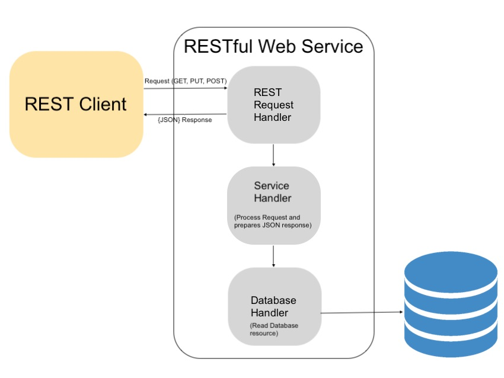

# REST API CRUD using PHP

**REST** or **Representational State Transfer** is one of the popular architectural style used to develop web services. This style of architecture contains constraints or rules to design web services which can be accessed from external apps or web applications.

## REST Constraints

The following constraints define the RESTfulness of an application or service.

- Client-Server architecture
- Statelessness
- Uniform interface
- Layered system
- Cacheability
- Code on Demand

## RESTful web services API architecture

The following diagram shows a RESTful web service architecture. In this diagram, the request-response flow among the client-server is represented.

